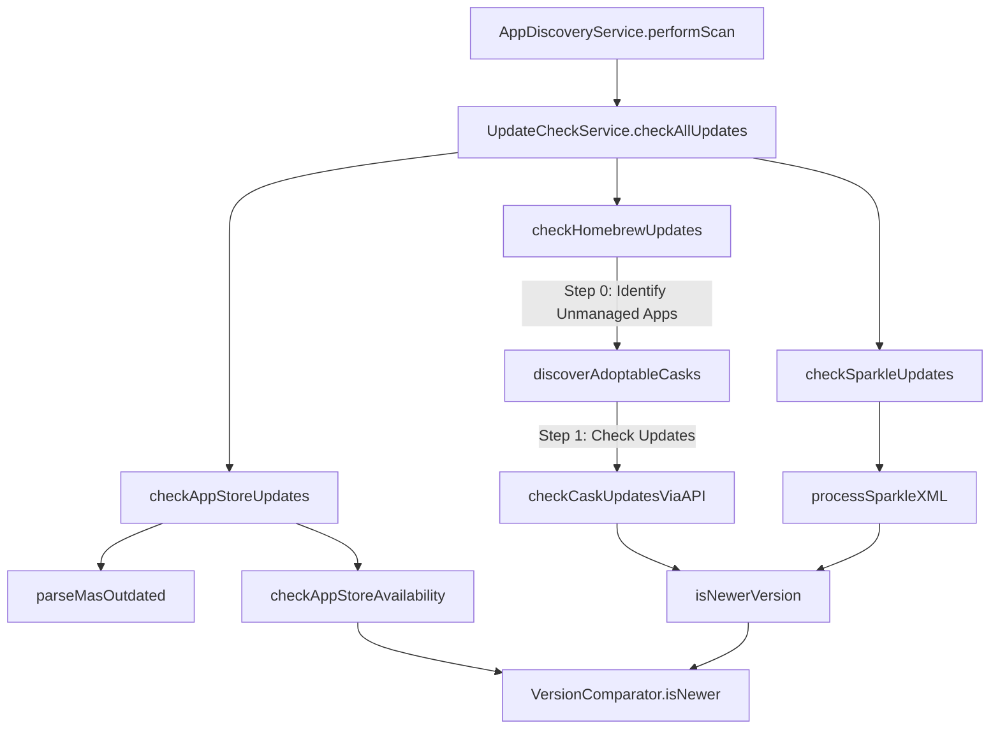
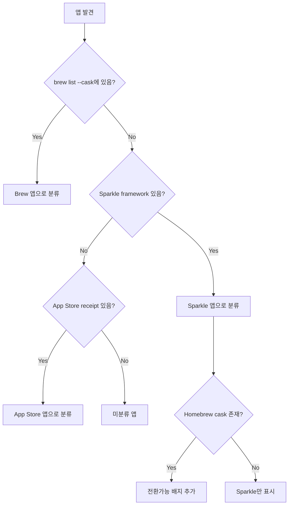
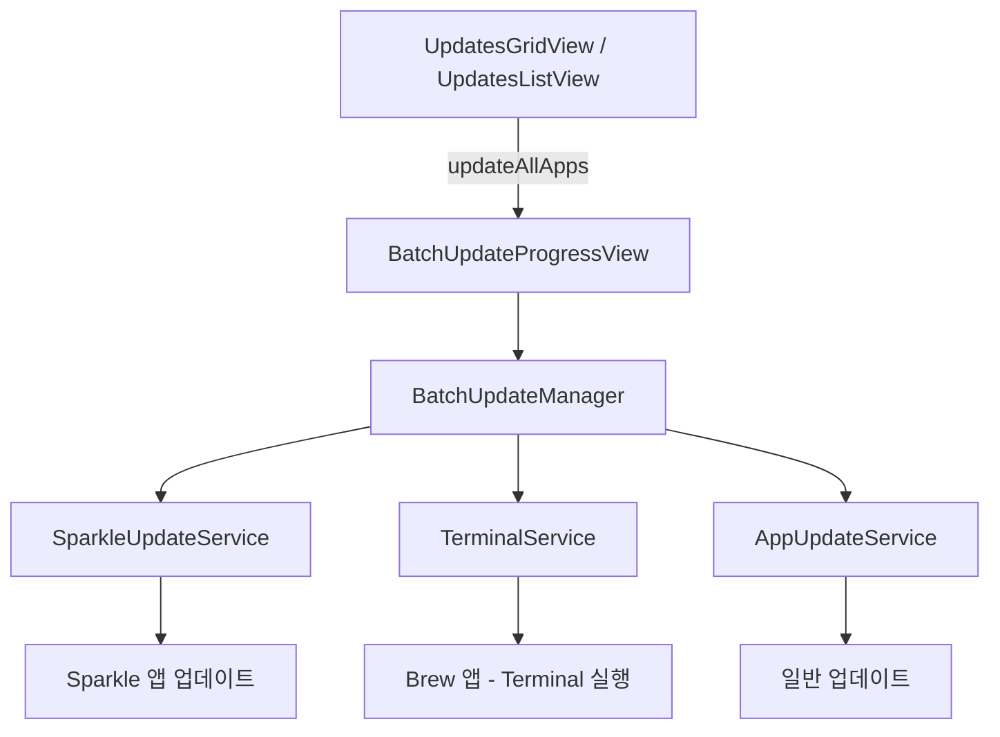

# Vesslo 업데이트 로직 아키텍처 문서

> **목적**: 업데이트 감지 로직 수정 시 부작용 방지를 위한 가이드라인

---

## 🏗️ 아키텍처 개요



---

## 🚨 앱 소스 분류 규칙 (CRITICAL)

> ⚠️ **이 규칙은 모든 업데이트 로직의 기본 원칙입니다. 반드시 준수!**

### 소스 분류 정의

| 앱 상태 | 표시 배지 | 업데이트 소스 | 조건 |
|---------|-----------|---------------|------|
| **Sparkle 앱** | `Sparkle` | Sparkle feed | `sparkleFeedURL != nil` |
| **Brew 앱** | `Brew` | Homebrew | `brew list --cask`에 존재 |
| **App Store 앱** | `App Store` | Mac App Store | App Store receipt 존재 |
| **전환가능 앱** | `전환가능` | - | Sparkle 앱이지만 Homebrew cask로 전환 가능 |

### 핵심 원칙

```
┌─────────────────────────────────────────────────────────────────┐
│  1. 앱의 "설치 방법"이 소스를 결정한다 (Installed via Brew)          │
│  2. Sparkle 앱은 Sparkle 배지, Brew 앱은 Brew 배지                │
│  3. Sparkle 앱이 Homebrew로 전환 가능하면 "전환가능" 배지/상태 표시  │
│  4. 한 앱이 Sparkle + Brew 동시에 표시되면 안 됨!                  │
│     (기존 오해 정정: Eagle은 Brew 앱이 맞음. 단, 정확한 Cask 매칭 필수) │
└─────────────────────────────────────────────────────────────────┘
```

### Eagle 이슈 재분석 (교훈)
- **오해**: Eagle은 Sparkle 앱인데 Brew로 잘못 표시됨 -> **정정**: Eagle은 Sparkle로 설치했으나, Brew Cask(`ogdesign-eagle`)도 존재하는 앱임.
- **문제**: Vesslo가 이름만 보고 엉뚱한 `eagle` (Autodesk) Cask와 매칭함.
- **해결**: Bundle ID(`tw.ogdesign.eagle`)를 확인하여 정확한 Cask와 매칭해야 함.
- **부작용 수정**: 이 보호 로직 때문에 `default-folder-x` 같이 Bundle ID 정보가 없는 정상 Cask까지 차단됨. -> **부분 일치(Partial Match) 허용**으로 완화.

### 소스 판정 흐름도



### ❌ 잘못된 분류 예시

| 상황 | 잘못된 표시 | 올바른 표시 |
|------|-------------|-------------|
| Sparkle 앱인데 cask 존재 | `Brew` 배지 | `Sparkle` + `전환가능` 배지 |
| Brew 설치 앱 | `Sparkle` 배지 | `Brew` 배지 |
| 둘 다 있는 앱 | `Sparkle` + `Brew` 동시 | 설치 방법에 따른 하나만 |

### ✅ 구현 시 체크리스트

1. [ ] `isInstalledViaBrew = true`는 **오직** `brew list --cask`에 있는 앱만
2. [ ] Sparkle 앱에 Brew 매칭되면 → `isAdoptable = true` (전환가능), NOT `isInstalledViaBrew`
3. [ ] `sources.insert(.homebrew)`는 **오직** Brew로 설치된 앱만
4. [ ] 매칭 로직에서 Sparkle 앱 보호: Bundle ID 검증 필수

---

## 📁 핵심 파일 및 책임

| 파일 | 책임 | 수정 시 주의사항 |
|------|------|------------------|
| `VersionComparator.swift` | 버전 비교 핵심 로직 | **모든 곳에서 사용됨** - 수정 시 전체 테스트 필요 |
| `UpdateEvaluator.swift` | 업데이트 판정 통합 로직 | **Homebrew 판정의 단일 진실 소스** |
| `UpdateCheckService.swift` | Homebrew 업데이트 체크 | `UpdateEvaluator` 사용 필수 |
| `UpdateCheckService+Sparkle.swift` | Sparkle/App Store 체크 | XML 파싱 패턴 변경 시 테스트 케이스 추가 |
| `AppHeaderView.swift` | 개별 앱 새로고침 | `UpdateEvaluator` 사용 필수 |
| `AppMetadataDetector.swift` | 앱 소스 감지 | Sparkle/Electron 구분 로직 |
| `AppItemData.swift` | 앱 이름/버전 파싱 | Finder 표시명 사용 |

---

## 📛 앱 이름 규칙 (AppItemData)

### 이중 이름 체계

| 필드 | 용도 | 소스 |
|------|------|------|
| `name` | UI 표시 | `FileManager.displayName` (Finder 표시명) |
| `matchingName` | Homebrew 매칭 | `CFBundleName` (영문 원본) |

```swift
// UI 표시용: Finder에 보이는 이름 (로케일 영향 받음)
self.name = FileManager.default.displayName(atPath: url.path)

// Homebrew 매칭용: CFBundleName (영문, 로케일 무관)
self.matchingName = infoDict["CFBundleName"] as? String ?? name
```

**이유**: 
- App Store 앱은 한국어 시스템에서 한글 이름으로 표시됨 (예: "지도", "페이지")
- Homebrew cask는 항상 영문 이름 사용
- `matchingName`으로 안정적인 매칭, `name`으로 사용자 친화적 표시

---

## 🔗 Homebrew Cask 매칭 규칙

### 5단계 매칭 전략 (우선순위 순)

> 2026-01-23 AI 리뷰 반영: 체계적인 확신도(Confidence) 기반 매칭

| 우선순위 | 방법 | 확신도 | 설명 |
|----------|------|--------|------|
| 1 | **Bundle ID 매칭** | 100% | `app.bundleIdentifier == cask.bundleIdentifiers[]` |
| 2 | **Exact Name + Bundle Domain 일치** | 95% | 이름 완전 일치 + Bundle ID 도메인 확인 |
| 3 | **Exact Name Only** | 70% | 이름만 일치 (⚠️ Eagle 케이스 주의) |
| 4 | **Fuzzy Match + Bundle 검증** | 80% | 부분 일치 + Bundle ID로 확인 |
| 5 | **Manual Review** | - | Adoptable로 표시, 사용자 결정 필요 |

> ⚠️ **중요**: 매칭에는 반드시 `matchingName`을 사용. `name`은 UI 표시용.

### ✅ 2026-01-23 Critical Fixes

#### 1. Bundle ID 필수 검증 (checkHomebrewUpdates)
```swift
// Cask에 Bundle ID가 있으면 반드시 앱 Bundle ID와 일치해야 함
func validateBundleID(_ app: AppItem, cask: BrewCask) -> Bool {
    let caskBundleIDs = cask.bundleIdentifiers
    if !caskBundleIDs.isEmpty {
        guard let appBundleID = app.bundleIdentifier else { return false }
        return caskBundleIDs.contains(where: { $0.lowercased() == appBundleID.lowercased() })
    }
    return true  // Cask에 Bundle ID 없으면 검증 불가 → 허용
}
```

> **해결된 문제**: Eagle(`tw.ogdesign.eagle`)이 `eagle` cask(`com.Autodesk.eagle`)로 잘못 매칭되던 문제

#### 2. homebrewCaskName 우선 (checkCaskUpdatesViaAPI)
```swift
// 버전 체크 시 homebrewCaskName이 설정된 앱은 해당 cask로만 업데이트 체크
if let app = apps.first(where: {
    // Priority 1: Exact homebrewCaskName match
    if let storedCaskName = $0.homebrewCaskName {
        return storedCaskName == caskName
    }
    // Priority 2: Name-based matching (fallback only)
    return $0.matchingName... == caskName.lowercased()
})
```

> **해결된 문제**: Eagle이 `ogdesign-eagle`로 매칭되었지만 버전 체크에서 `eagle` cask의 버전(`9.6.2`)을 사용하던 문제

### Bundle ID 추출 소스 (BrewCaskService)

| 소스 | 예시 | 신뢰도 |
|------|------|--------|
| `uninstall.quit` | `com.microsoft.Excel` | 높음 |
| `uninstall.launchctl` | `com.microsoft.autoupdate2` | 중간 |
| `zap.trash` 경로 | `~/Library/Containers/com.microsoft.Excel` | 높음 |
| `uninstall.pkgutil` | `com.microsoft.package.Microsoft_Excel.app` | 낮음 (패키지 ID) |


---

## 🔢 버전 정규화 규칙 (VersionComparator.cleanVersion)

| 입력 형식 | 정규화 결과 | 규칙 |
|----------|-------------|------|
| `v1.2.3` | `1.2.3` | 'v' 접두어 제거 |
| `7.1.1 (22340)` | `7.1.1.22340` | 괄호 빌드 번호를 점 표기로 **변환** |
| `2.8(1007)` | `2.8` | 공백 없는 괄호는 **제거** |
| `4.0,17` | `4.0.17` | ✅ 쉼표를 점으로 **변환** (2026-01-23) |
| `1.2+metadata` | `1.2` | + 이후 제거 |
| `1.2-beta` | `1.2-beta` | Pre-release 보존 |

> ⚠️ **Stream Deck 수정**: `" (숫자)"` 패턴은 제거가 아닌 **변환**으로 처리
> - 변환 전: `7.1.1 (22340)` vs `7.1.1.22340` → 업데이트 있음 (오류)
> - 변환 후: `7.1.1.22340` vs `7.1.1.22340` → 동일 (정상)

---

## 📦 Sparkle 소스 감지 규칙 (AppMetadataDetector)

### 감지 프레임워크 경로
```swift
sparklePaths = [
    "Sparkle.framework",
    "Sparkle.framework/Versions/B",
    "SparkleCore.framework",
    "Updater.framework",
    // ❌ Squirrel.framework 제외! (Electron 앱용)
    "DevMateKit.framework",
    "ShipKit.framework",
    "AppUpdater.framework",
    "SelfUpdate.framework"
]
```

### ⚠️ Squirrel vs Sparkle
| 프레임워크 | 사용처 | 업데이트 방식 |
|------------|--------|---------------|
| **Sparkle** | 네이티브 macOS 앱 | `appcast.xml` 피드 |
| **Squirrel** | Electron 앱 | 자체 업데이트 서버 |

**Squirrel 사용 앱 예시**: Cursor, VS Code, Slack, Discord, Notion
→ 이 앱들은 **Homebrew**로 업데이트 체크해야 함!

---

## 🔄 버전 비교 규칙 (VersionComparator.isNewer)

### 판정 순서 (위에서 아래로 체크)
```
1. 문자열 완전 일치 → FALSE (업데이트 없음)
2. 괄호 포함 체크: current.contains("(newVersion)") → FALSE
3. cleanVersion 후 일치 → FALSE
4. Prefix 체크: cleanCurrent.hasPrefix(cleanNew + ".") → FALSE
5. ✅ Reverse Prefix 체크 (2026-01-23): cleanNew.hasPrefix(cleanCurrent + ".") → FALSE
   - 앱 버전이 빌드 번호 없이 간단한 경우 처리 (예: Stream Deck)
6. Pre-release 추출 및 numeric 파트 비교
7. Alpha suffix 비교 (1.0a < 1.0b < 1.0)
8. Pre-release 비교 (alpha < beta < rc < release)
```

> ⚠️ **2026-01-23 수정**: Stream Deck `7.1.1` vs `7.1.1.22340` 문제 해결
> - 새 버전(cask)이 현재 버전 + "."으로 시작하면 → 동일 버전 (빌드 번호 차이만)

### cleanVersion 로직
```swift
"v1.2.3" → "1.2.3"      // 'v' 접두어 제거
"7.1.1 (22340)" → "7.1.1.22340"  // 괄호 빌드 번호를 점 표기로 변환
"2.8(1007)" → "2.8"     // 공백 없는 괄호는 제거
"1.2.3,build4" → "1.2.3" // 쉼표 이후 제거
"1.2.3+build4" → "1.2.3" // 플러스 이후 제거
```

---

## 🍺 Homebrew 업데이트 체크 흐름

### ⭐ 중앙화된 판정 (UpdateEvaluator.evaluateHomebrewUpdate)

> 모든 Homebrew 업데이트 판정은 `UpdateEvaluator`를 통해 수행해야 합니다.

### 파라미터 명세
| 파라미터 | 소스 | 예시 |
|----------|------|------|
| `currentVersion` | `app.version` (CFBundleShortVersionString) | `"16.105"` |
| `currentBuild` | `app.buildNumber` (CFBundleVersion) | `"16.105.26011018"` |
| `latestVersion` | `caskInfo.cleanVersion` (쉼표 이전 부분) | `"16.106"` |
| `buildInfo` | `caskInfo.version`의 쉼표 이후 부분 (옵션) | `"build123"` |

> **cleanVersion**: `caskInfo.version`에서 `",build123"` 같은 빌드 정보를 제거한 버전

```swift
// 실제 사용 예시
let latestVersion = caskInfo.cleanVersion ?? caskInfo.version  // "16.106"
let buildInfo = caskInfo.version.contains(",") 
    ? caskInfo.version.components(separatedBy: ",").dropFirst().first 
    : nil  // "build123" or nil

let result = UpdateEvaluator.evaluateHomebrewUpdate(
    currentVersion: app.version,       // "16.105"
    currentBuild: app.buildNumber,     // "16.105.26011018"
    latestVersion: latestVersion,      // "16.106"
    buildInfo: buildInfo               // nil or "build123"
)

switch result {
case .updateAvailable(let version, _):
    app.targetVersion = version  // 업데이트 있으면 설정
case .upToDate:
    // ⚠️ targetVersion 변경 금지! 로그만 남김
    ConsoleLog.info("Up to date: \(app.name)")
}
```

### 내부 판정 순서
1. **buildNumber == latestVersion** → `upToDate` (Homebrew가 빌드 번호를 version으로 보고)
2. **VersionComparator.isNewer(latestVersion, currentVersion)** → `updateAvailable` or `upToDate`

### 사용 위치
- `UpdateCheckService.checkCaskUpdatesViaAPI` → `UpdateEvaluator` 호출
- `AppHeaderView.refreshHomebrewApp` → `UpdateEvaluator` 호출

---

## 📦 Sparkle 업데이트 체크 흐름

### ⭐ 시작 시 Sparkle URL 재감지 (checkSparkleUpdate)

> 상세 페이지 새로고침과 동일한 방식으로 시작 시에도 URL을 재감지합니다.

```swift
// sparkleFeedURL이 없으면 Info.plist에서 다시 찾음
if feedURLString == nil || feedURLString?.isEmpty == true {
    let infoPlistURL = app.url.appendingPathComponent("Contents/Info.plist")
    if let plist = NSDictionary(contentsOf: infoPlistURL) as? [String: Any] {
        if let detectedURL = AppMetadataDetector.findSparkleURL(for: plist, at: app.url) {
            app.sparkleFeedURL = detectedURL
            app.sources.insert(.sparkle)
        }
    }
}
```

**이유**: 
- 초기 `detectMetadata`에서 URL 감지 실패할 수 있음
- 상세 페이지에서만 찾아지던 문제 해결 (ChatGPT Atlas, CleanMyMac, CleanShot 등)

### detectMetadata 규칙

```
1. hasSparkleFramework → 무조건 .sparkle 소스 추가
2. findSparkleURL 성공 → sparkleFeedURL 설정
3. URL 실패해도 .sparkle 유지 → checkSparkleUpdate에서 재시도
```

> ⚠️ **중요**: `hasSparkle`이면 URL 없어도 `.sparkle` 추가! URL은 나중에 재감지.

### processSparkleXML
```
1. extractLatestVersion: 모든 item에서 최고 버전 선택
2. minimumSystemVersion 호환성 체크
3. isNewerVersion(latest, current)
4. 업데이트 없으면 로그만 남기고 targetVersion 변경 금지 (additive-only)
```

> ⚠️ **중요**: Sparkle에서 업데이트가 없어도 `targetVersion = nil` 설정 **금지**!
> 다른 소스(Homebrew)가 이미 업데이트를 찾았을 수 있음.

### extractLatestVersion 로직
```
1. shortVersionString 속성에서 모든 버전 수집
2. (없으면) sparkle:version 속성에서 수집
3. VersionComparator로 최고 버전 선택
```

---

## 🍎 App Store 업데이트 체크 흐름

### ⭐ 중앙화된 판정 (UpdateEvaluator.evaluateAppStoreUpdate)

```swift
let result = UpdateEvaluator.evaluateAppStoreUpdate(
    currentVersion: app.version,
    storeVersion: storeVersion
)

switch result {
case .updateAvailable(let version, _):
    app.targetVersion = version
case .upToDate:
    // targetVersion = nil 설정 금지!
}
```

### mas outdated 모드
```
1. mas outdated 명령 실행
2. 결과 파싱: "AppName (currentVer) < newVer [trackingID]"
3. 매칭 순서:
   a. trackingID로 app.appStoreID 매칭 (가장 정확)
   b. 앱 이름으로 app.matchingName 매칭 (fallback)
```

### iTunes API 모드
```
1. bundleID로 iTunes API 조회
2. UpdateEvaluator.evaluateAppStoreUpdate 사용
3. 업데이트 없으면 로그만 (additive-only)
```

---

## �📢 Notification 흐름

| Notification | 발송 조건 | 리스너 | 동작 |
|--------------|-----------|--------|------|
| `.updateCheckCompleted` | 전체 체크 완료 | VessloApp, AppDiscoveryService | exportData(), 캐시 저장 |

> ⚠️ `.updateFound`에서 `exportData()` 호출하면 안 됨 (스팸 발생)

---

## 💾 앱 캐싱 전략 (App Caching Strategy)

앱 목록과 메타데이터는 오프라인 지원 및 빠른 시작을 위해 `CachedAppItem` 구조체로 캐싱됩니다.

### 캐시 저장 필드
| 필드 | 설명 |
|------|------|
| `urlPath` | 앱 번들 경로 |
| `sourceRawValues` | 감지된 업데이트 소스 |
| `sparkleFeedURL` | 런타임 감지된 Sparkle URL |
| `homebrewCaskName` | Cask 이름 |
| `targetVersion` | 마지막으로 발견된 업데이트 버전 |

### 캐시 복원 로직 (AppDiscoveryService)

```swift
// 1. Info.plist로 AppItem 생성 (detectMetadata 실행 → sparkleFeedURL 감지)
let app = AppItem(url: url, infoDict: infoDict)

// 2. 캐시된 값 복원 (nil이면 덮어쓰지 않음!)
app.sources = Set(item.sourceRawValues.compactMap { UpdateSource(rawValue: $0) })
app.homebrewCaskName = item.homebrewCaskName

// ⚠️ 핵심: 캐시에 값이 있을 때만 덮어씀
if let cachedURL = item.sparkleFeedURL {
    app.sparkleFeedURL = cachedURL  // 캐시 값 사용
}
// else: AppItem init에서 감지한 URL 유지

app.targetVersion = item.targetVersion
```

> **ChatGPT Atlas 이슈**: 이전에는 `app.sparkleFeedURL = item.sparkleFeedURL`로 무조건 덮어써서,
> 캐시에 nil이 있으면 init에서 감지한 URL이 사라졌음. 이제 조건부 복원으로 해결.

> **CleanMyMac / Unmanaged Apps 이슈**: `brew list`에 없는 앱은 업데이트 검사에서 제외됨.
> 해결책: `discoverAdoptableCasks`를 업데이트 검사 **이전**에 실행하여 Cask 이름을 먼저 확보하고, 관리되지 않는 앱도 검사 대상에 포함.

> **Cached Startup 이슈**: 캐시된 앱 목록을 로드할 때(`loadAppsFromCache`) 업데이트 체크 함수(`checkForUpdates`) 호출이 누락되어 있었음. 수정 완료.

---

## 🚀 시작 시 업데이트 감지 로직 (Startup Logic)

앱 시작 시 업데이트 감지가 실패하는 문제를 방지하기 위한 핵심 로직입니다.

### 1. 실행 순서의 중요성 (Unmanaged Apps)
CleanMyMac, ChatGPT Atlas 등 직접 설치했지만 Homebrew Cask로 업데이트 가능한 앱(Unmanaged)을 감지하기 위해서는 **반드시 식별이 먼저** 이루어져야 합니다.

**잘못된 순서 (이전)**:
1. 업데이트 체크 (CleanMyMac은 Cask 이름을 몰라서 제외됨)
2. `discoverAdoptableCasks` (이제서야 "아, 얘는 cleanmymac이야" 하고 식별) → **Too Late**

**올바른 순서 (현재)**:
1. `discoverAdoptableCasks` (먼저 식별: CleanMyMac -> cleanmymac)
2. 업데이트 체크 (식별된 cleanmymac을 포함하여 검사)

### 2. 캐시된 앱의 업데이트 트리거 (Cached Startup)
앱이 캐시된 상태로 시작될 때(`loadAppsFromCache`)는 `scanApps`(디스크 스캔)를 건너뛰므로, **명시적으로 업데이트 체크를 호출**해야 합니다.

```swift
// AppDiscoveryService.loadAppsFromCache
if AppSettings.shared.checkUpdatesOnLaunch {
    // UI 안정화를 위해 1초 딜레이 후 실행
    DispatchQueue.main.asyncAfter(deadline: .now() + 1.0) {
        UpdateCheckService.shared.checkForUpdates(apps: loadedApps)
    }
}
```

### 3. Sparkle Race Condition 방지
비동기 업데이트 특성상, 감지된 URL을 객체(`app`)에 넣고 다시 읽으려 하면 타이밍 이슈(nil 반환)가 발생합니다.
**해결**: 감지된 URL을 **지역 변수(Local Variable)**에 담아 즉시 검사 함수에 전달합니다.

---

## ⚡️ 성능 최적화 (Performance Optimization)

### 1. BrewCaskService O(1) 조회 (2026-01-20 적용)
기존에는 특정 Cask 정보를 찾을 때마다 전체 리스트(`allCasks`, 수천 개)를 선형 탐색(O(N))했습니다. 앱이 많을 경우 시작 속도에 영향을 줄 수 있어, **Dictionary 기반 O(1) 조회**로 최적화했습니다.

```swift
// BrewCaskService.swift (최적화 적용)
private var allCasks: [BrewCask] = [] {
    didSet { rebuildCaskMap() } 
}
private var caskMap: [String: BrewCask] = [:] // Token -> Cask 매핑

func getCask(token: String) -> BrewCask? {
    return caskMap[token] // O(1) Instant Lookup
}
```

이로 인해 `checkHomebrewUpdates` 및 `discoverAdoptableCasks` 실행 시 CPU 부하가 대폭 감소했습니다.

---

## ✅ 수정 체크리스트

### VersionComparator 수정 시
- [x] 전체 테스트 케이스 통과 확인
- [x] UpdateCheckService의 모든 isNewerVersion 호출 검토
- [x] AppHeaderView의 버전 비교 로직 검토

### Homebrew 로직 수정 시
- [x] `UpdateCheckService.checkCaskUpdatesViaAPI` 수정
- [x] `AppHeaderView.refreshHomebrewApp` 동일하게 수정
- [x] buildNumber 필터 로직 일치 확인

### Sparkle 로직 수정 시
- [x] `processSparkleXML` 수정
- [x] 업데이트 없을 시 **targetVersion 변경 금지** 확인 (additive-only)
- [x] minimumSystemVersion 체크 유지 확인

---

## 🎯 다중 소스 우선순위

앱이 여러 소스(Homebrew + Sparkle)를 가질 때의 규칙:

### 원칙: Last Write Wins (마지막 설정 유지)
```
1. Homebrew 체크: targetVersion = "2.5" 설정
2. Sparkle 체크: 
   - 더 최신 버전 발견 → targetVersion = "2.6" (덮어씀)
   - 최신 없음 → 변경 안 함 ("2.5" 유지)
```

### 결과적 동작
- 각 소스는 **더 최신 버전을 찾았을 때만** `targetVersion` 설정
- 다른 소스의 결과를 지우지 않음 (additive-only)
- 마지막으로 더 높은 버전을 찾은 소스의 값이 최종 표시됨

> **참고**: `UpdateEvaluator.selectBestUpdate()`로 여러 소스 결과를 비교하여
> 가장 높은 버전을 선택할 수 있음 (현재는 순차 실행으로 마지막 값 사용)

### Notification 수정 시
- [x] `.updateFound`는 고빈도 - 무거운 작업 금지
- [x] `.updateCheckCompleted`에서만 캐시/export 작업

---

## ❌ 금지 사항

1. **buildNumber.contains(version) 사용 금지**
   - 정확히 일치(`==`)만 사용
   - `contains()`는 과도한 false negative 발생

2. **isNewerVersion 우회 금지**
   - 모든 버전 비교는 `VersionComparator.isNewer` 사용
   - 직접 문자열 비교(`!=`, `==`) 사용 금지

3. **개별 소스에서 targetVersion = nil 설정 금지** ⚠️ 중요
   - Sparkle 체크에서 `targetVersion = nil` 금지
   - Homebrew 체크에서 `targetVersion = nil` 금지
   - **이유**: 앱이 여러 소스(Brew + Sparkle)를 가질 때, 한 소스가 다른 소스의 업데이트를 지워버림
   - **올바른 방법**: 업데이트 없으면 로그만 남기고, 있으면 설정만 함 (additive-only)

4. **UpdateEvaluator 우회 금지**
   - Homebrew 업데이트 판정은 반드시 `UpdateEvaluator.evaluateHomebrewUpdate` 사용
   - 직접 `buildNumber == latestVersion` 또는 `isNewerVersion` 호출 금지

---

## 📊 테스트 케이스

### 버전 비교 테스트
| current | new | 예상 결과 | 설명 |
|---------|-----|-----------|------|
| `16.105 (16.105.26011018)` | `16.105.26011018` | FALSE | 괄호 포함 체크 |
| `2.2.6` | `2.2` | FALSE | Prefix 체크 |
| `v1.2.3` | `1.2.4` | TRUE | 'v' 접두어 제거 |
| `1.0` | `1.0.1` | TRUE | 더 구체적인 버전 |

### 빌드 번호 테스트
| version | buildNumber | latestVersion | 예상 결과 |
|---------|-------------|---------------|-----------|
| `16.105` | `16.105.26011018` | `16.105.26011018` | SKIP (정확히 일치) |
| `16.105` | `16.105.26011018` | `16.105.26012000` | UPDATE (새 빌드) |

---

## ⚠️ 알려진 문제점 및 주의사항 (Known Issues)

> **[RESOLVED]** 2026-01-23 기준 발견 및 해결된 버그 기록입니다. (참고용 Archive)

### Issue #1: Token Match 시 Bundle ID 검증 누락 (Eagle 충돌)

**현상**: Sparkle 앱 `Eagle`(이미지 관리)이 Homebrew 앱 `eagle`(PCB 설계)로 잘못 인식됨.

**원인 위치**: `UpdateCheckService.checkHomebrewUpdates` → Method 2 (Token Match)
```swift
// 현재 코드 (Line 298-327) - 문제점
if let app = apps.first(where: { 
    $0.homebrewCaskName?.lowercased() == normalizedToken 
}) {
    // ⚠️ Bundle ID 검증 없이 바로 isInstalledViaBrew = true 설정
    app.isInstalledViaBrew = true
}
```

**수정 필요**: Token Match 성공 시에도 **반드시 Bundle ID 교차 검증** 후 승격할 것.

---

### Issue #2: 괄호 빌드 번호 정규화 미흡 (Stream Deck 무한 업데이트)

**현상**: `7.1.1 (22340)` vs `7.1.1.22340` 비교 시 업데이트 있다고 판정.

**원인 위치**: `VersionComparator.cleanVersion`
- 현재 로직은 `(22340)`을 단순 제거하여 `7.1.1`로 변환.
- Cask 버전 `7.1.1.22340`과 비교 시 Prefix Check 통과 → 오판.

**수정 필요**: `" (숫자)"` 패턴을 `".숫자"`로 **변환** (제거가 아님).
```swift
// "7.1.1 (22340)" → "7.1.1.22340" (정규화)
if let parenRange = cleaned.range(of: #" \(\d+\)"#, options: .regularExpression) {
    // 변환, 제거 아님
}
```

---

### Issue #3: 짧은 이름 앱 Fuzzy Match 실패 (MS Office Word/Excel)

**현상**: `Word`(4자), `Excel`(5자)이 Fuzzy Match 조건 실패로 Adoptable 상태로 떨어짐.

**원인 위치**: `UpdateCheckService.checkHomebrewUpdates` → Fuzzy Match Guard
```swift
guard app.matchingName.count > 4 else { return false }  // "Word" = 4자 → 실패
```

**영향**: `PowerPoint`(10자), `Outlook`(7자)은 정상 매칭되나 `Word`만 누락됨.

**수정 필요**: 
1. Bundle ID 매칭을 **최우선**으로 시도 (이름에 의존하지 않음).
2. 또는 Fuzzy Match에서 **정확히 포함되는 경우** 예외 허용.

---

### 공통 교훈

1. **매칭 순서 준수**: Bundle ID > Exact Name > Fuzzy (본 문서 Line 73-77)
2. **교차 검증 필수**: 하나의 조건 만족으로 확정하지 말고, 가능한 여러 조건 확인
3. **정규화 일관성**: 동일한 의미의 버전 표기(`(build)` vs `.build`)를 통일된 형식으로 변환

---

### Issue #4: Adoptable 앱에 Brew 배지 잘못 표시 (ACC 오분류) - **[RESOLVED 2026-01-29]**

**현상**: Adobe Creative Cloud (ACC)가 `brew list --cask`에 없는데도 "Brew" 배지가 표시됨.

**원인 위치**: `UpdateCheckService.checkCaskUpdate` → Line 719
```swift
// 기존 코드 (버그)
match.sources.insert(.homebrew)     // ← adoptable 앱에도 무조건 추가!
```

**발생 흐름**:
1. `discoverAdoptableCasks` → ACC에 `homebrewCaskName = "adobe-creative-cloud"` 설정 (정상)
2. `checkCaskUpdatesViaAPI` → `unmanagedCasks`에 포함되어 업데이트 체크됨
3. `checkCaskUpdate` → **`.homebrew` 소스가 무조건 추가됨** ← 버그!

**수정 내용**:
```swift
// CRITICAL FIX (2026-01-29)
if match.isInstalledViaBrew {
    match.sources.insert(.homebrew)
}
```

> **교훈**: `homebrewCaskName`이 있다고 해서 `.homebrew` 소스를 추가하면 안 됨. 
> `isInstalledViaBrew = true`인 경우에만 `.homebrew` 소스 추가!

**추가 수정 (2026-01-29)**:
- `checkCaskUpdatesViaAPI`와 `checkCaskUpdate` 함수에 `managedCasks`/`isManaged` 파라미터 추가
- `brew list --cask` 결과에 있는 cask만 `isInstalledViaBrew = true` 및 `.homebrew` 소스 설정
- 이를 통해 cask 캐시가 없어도 정확한 분류 가능

---

### Issue #5: Adoptable 앱에 `homebrewCaskName` 미설정 (2026-01-29)

**증상**: Creative Cloud, XnViewMP 등 Adoptable 앱들이 Updates 탭에서 **Manual**로만 표시되고 Adoptable 배지가 안 보임

**원인** (`UpdateCheckService.swift:482-488`):
```swift
// 문제: homebrewCaskName이 managed cask에만 설정됨
if managedCasks.contains(caskName) {
    app.isInstalledViaBrew = true
    app.sources.insert(.homebrew)
    app.homebrewCaskName = caskName  // ← 여기서만 설정!
}
```

**영향**:
- Adoptable 앱은 `homebrewCaskName = nil`
- `isAdoptable = homebrewCaskName != nil && !isInstalledViaBrew` → **false**
- Adoptable 배지 및 섹션 표시 안 됨

**수정**:
```swift
// homebrewCaskName은 항상 설정 (Adoptable 표시용)
app.homebrewCaskName = caskName
if managedCasks.contains(caskName) {
    app.isInstalledViaBrew = true
    app.sources.insert(.homebrew)
}
```

> **교훈**: `homebrewCaskName`은 "이 앱이 Homebrew cask로 관리 **가능**함"을 의미.
> `isInstalledViaBrew`는 "이 앱이 Homebrew로 **설치됨**"을 의미.
> 두 속성은 독립적으로 설정되어야 함!

---

## 🛡️ Cask Token 정규화 및 무결성 전략 (2026-01-25 추가)

> **목적**: "Default Folder X.app"과 같이 잘못된 Cask 이름이 시스템 내부로 유입되어 "Unavailable" 에러를 유발하는 것을 **원천 차단**합니다.

### 핵심 원칙: "Ingress Sanitization" (입구 봉쇄)

실행 시점(Last-mile)이나 개별 로직에서 수동으로 검사하는 대신, 데이터가 생성되거나 로드되는 **모든 진입점(Entry Points)** 에서 즉시 정규화를 수행합니다.

| 진입점 (Ingress Point) | 담당 파일 | 동작 |
|-------------------|-----------|------|
| **1. 캐시 로드** | `AppDiscoveryService` | 디스크 캐시에서 로드 즉시 `canonicalizeToken` 실행 |
| **2. 앱 초기화** | `AppItemViewModel` | `init` 시점에 Cask 이름이 있으면 무조건 교정 |
| **3. 업데이트 매칭** | `UpdateCheckService` | `checkHomebrewUpdates`에서 이름 할당 전 교정 |
| **4. 삭제 복원** | `DeletedAppStorageService` | `record.homebrewCaskName` 로드 시 교정 |
| **5. 수동 입양** | `AdoptionSheetView` | 사용자 입력/선택 즉시 교정하여 로직 전달 |

### 정규화 로직 (Single Source of Truth)

모든 정규화는 **오직 `BrewCaskService.canonicalizeToken(_:)`** 하나만 사용합니다.

```swift
func canonicalizeToken(_ token: String) -> String {
    // 1. .app 제거 및 공백을 대시(-)로 치환
    // 2. Cask DB에 존재하는지 확인 (Original vs Normalized)
    // 3. 존재하면 해당 토큰 반환, 둘 다 없으면 포맷에 따라 강제 교정
}
```


---

## 🏗️ 실행 로직의 중앙화 (AppUpdateService Delegation)

> **원칙**: 모든 UI 컴포넌트(`View`)는 업데이트를 직접 실행(`Process()`)해서는 안 됩니다. 반드시 `AppUpdateService`에 위임해야 합니다.

### 위반 사례 (Anti-Pattern) ❌
```swift
// AppHeaderView.swift (Bad)
// 뷰 내부에서 자체적으로 프로세스 생성 및 실행
// 문제점: 중앙 정규화 로직이 적용되지 않음 ("Default Folder X.app" 에러의 원인)
func actuallyPerformUpdate() {
   let task = Process()
   task.arguments = ["upgrade", "--cask", app.name] // 🚨 위험! .app 포함될 수 있음
   task.launch()
}
```

### 올바른 패턴 (Best Practice) ✅
```swift
// AppHeaderView.swift (Good)
// 중앙 서비스에 위임 -> 여기서 canonicalizeToken 등 모든 안전장치 적용됨
func actuallyPerformUpdate() {
    Task {
        await AppUpdateService.shared.updateApp(app)
    }
}
```

### 책임 분리
- **View**: 사용자 인터랙션 처리, 로딩 상태 표시
- **AppUpdateService**: Cask 이름 정규화, `brew` 명령어 구성, 로그 기록, 에러 핸들링
- **BrewCaskService**: 정규화 알고리즘 제공, Cask 데이터 제공

---

## 🔄 일괄 업데이트 UI (Batch Update Progress) - 2026-01-28 추가

### 개요
"모두 업데이트" 버튼 클릭 시 표시되는 진행 상황 UI.
Updatest 대비 차별화: 타임라인 뷰, 예상 시간, 드래그 순서 변경, 완료 요약.

### 아키텍처



### BatchUpdateManager 상태

| 상태 | 설명 |
|------|------|
| `pending` | 대기 중 |
| `inProgress` | 업데이트 진행 중 (진행률 표시) |
| `completed` | 완료 |
| `failed` | 실패 (재시도 가능) |
| `skipped` | 사용자가 건너뜀 |

### UI 섹션

| 섹션 | 설명 |
|------|------|
| **ProgressHeader** | 전체 진행률 바 + 완료/전체 개수 + 예상 시간 |
| **UpdateTimelineRow** | 각 앱의 상태를 타임라인 형태로 표시 |
| **UpdateResultsSummary** | 완료 후 통계 요약 |

### 핵심 원칙

1. **View는 상태만 표시**: `BatchUpdateManager`가 모든 상태 관리
2. **순차 실행**: Sparkle 앱은 순차적으로 업데이트 (UI 인터랙션 필요)
3. **Terminal 위임**: Password Required 앱은 Terminal에서 실행
4. **드래그 순서 변경**: 대기 중인 앱 순서 변경 가능
5. **실패 시 재시도**: Failed 상태에서 개별 재시도 가능

### 파일 구조

```
Views/
└── BatchUpdate/
    ├── BatchUpdateProgressView.swift     # 메인 컨테이너
    ├── ProgressHeader.swift              # 상단 진행률 대시보드
    ├── UpdateTimelineRow.swift           # 타임라인 행
    └── UpdateResultsSummary.swift        # 완료 후 요약

Services/
└── BatchUpdateManager.swift              # 상태 관리 ObservableObject
```

---

## 🍎 iTunes API 플랫폼 필터링 (iOS/macOS 구분)

> ⚠️ **중요**: 동일한 Bundle ID로 iOS/macOS 앱이 각각 존재할 수 있음

### 문제 상황

iTunes API는 Bundle ID로 앱을 검색할 때 **iOS 앱과 macOS 앱을 구분하지 않음**.

**예시: StarDesk**
| 플랫폼 | Bundle ID | 버전 |
|--------|-----------|------|
| macOS 네이티브 | `com.stardesk` | 1.0.5 |
| iOS (App Store) | `com.stardesk` | 1.0.9 |

→ iTunes API가 iOS 앱(1.0.9) 반환 → macOS 앱에 잘못 적용됨!

### 해결 방법

`checkAppStoreAvailability` 함수에서 플랫폼 검증:

```swift
// iTunes API 응답에서 플랫폼 확인
let kind = result["kind"] as? String ?? ""
let isMacApp = kind == "mac-software"
let supportedDevices = result["supportedDevices"] as? [String] ?? []
let supportsMac = supportedDevices.contains { $0.lowercased().contains("mac") }

// iOS 앱 데이터인데 설치된 앱이 macOS 네이티브인 경우 → 스킵
if !isMacApp && !supportsMac && !app.isiOSApp {
    print("⚠️ Skipping iOS App Store data for macOS app: \(app.name)")
    return
}
```

### 판단 기준

| API 응답 필드 | macOS 앱 값 | iOS 앱 값 |
|--------------|-------------|-----------|
| `kind` | `mac-software` | `software` |
| `supportedDevices` | `["MacDesktop-MacDesktop", ...]` | `["iPhone14-iPhone14", ...]` |

### 적용 순서

1. Bundle ID 일치 확인 ✅
2. **플랫폼 일치 확인** ← 새로 추가
3. 버전 비교 및 업데이트 정보 적용

---

## 📦 PKG 기반 DMG 업데이트 처리

> ⚠️ **일부 앱은 DMG 내에 `.app` 대신 `.pkg` 설치 파일을 포함**

### 문제 상황

AdGuard 같은 앱의 DMG:
```
/Volumes/AdGuard/
├── AdGuard.pkg    ← .app이 아님!
└── .DS_Store
```

기존 `findAppInVolume`은 `.app`만 찾아서 실패.

### 해결 방법

`installFromDMG`에서 PKG 먼저 확인:

```swift
// 1. PKG 파일 먼저 확인
if let pkgURL = self.findPkgInVolume(mountPoint) {
    // Finder에서 DMG 열기 (사용자가 직접 설치)
    NSWorkspace.shared.open(mountPoint)
    throw UpdateError.pkgInstallRequired(pkgURL)
}

// 2. .app 파일 찾기 (기존 로직)
let appURL = try self.findAppInVolume(mountPoint)
```

### 처리 결과

| 패키지 타입 | 처리 방식 |
|------------|----------|
| `.app` | 자동 복사 (기존) |
| `.pkg` | Finder 열고 수동 설치 유도 |

---

